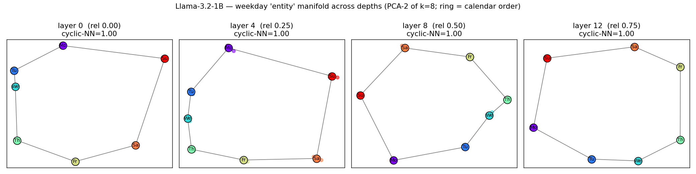
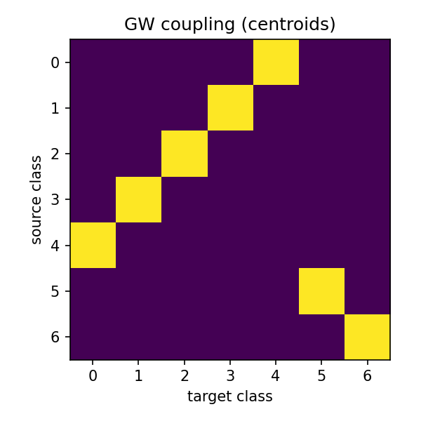

# Experiment Report — 2026-06-21--universal-manifolds--lucid-glacier

> Auto-generated by `/interpret-experiment` on 2026-06-23 (updated with the gpt2 cross-family extension). Read alongside `plan/RESEARCH_OBJECTIVE.md` and `plan/PLAN.md`.

## 1. Objective

Determine whether a concept that two independently-trained language models both represent occupies the
**same intrinsic geometric structure** in each model — such that a low-distortion correspondence between the
two models' concept manifolds can be recovered **from geometry alone, without supervision** — and whether that
compute-discovered correspondence coincides with the human-interpretable concept.

## 2. Headline finding

**Yes — and across architecture, not just scale.** The weekday concept is encoded as the *same* low-distortion
7-cycle in three independently-trained models spanning a 65× size range and two architectures (GPT-2 124M, Llama-3.2-1B,
Llama-3.1-8B). The label-free Gromov-Wasserstein alignment between the weekday manifolds is **12–39× tighter across
scale** (1B↔8B) and **7–20× tighter across architecture** (gpt2↔8B) than the same alignment against a *different*
concept (alphabet) (`artifacts/universal_manifold/weekdays_*_8b_d*/metrics.json` vs `.../wd*_alpha8b_d*/`). The
scale-invariant distance-correlation of the weekday geometry is **0.83–0.91 across scale and 0.78–0.89 across
architecture** — nearly identical. Most strikingly, GPT-2 **scores 0/49 on the weekday-arithmetic task yet still
represents the days as a clean cyclic ring** (cyclic-NN = 1.00 at every depth), and at the embedding layer the
unsupervised gpt2↔8B correspondence recovers the human day-mapping **perfectly (7/7, mod the cycle's symmetry)**
(`artifacts/universal_manifold/weekdays_gpt2_8b_d0.00/metrics.json`).

## 3. Verdict against success criteria

| Criterion | Result | Evidence |
|---|---|---|
| **SC1** weekdays 1B↔8B distance-correlation ≥ 0.70 **and** GW below 5th-pct shuffle null (p<0.05) | **met (scale & family)** | distance-correlation 0.78–0.91 at all depths for both 1B↔8B and gpt2↔8B; GW null p<0.05 at shallow depths (1B↔8B 0.013/0.000; gpt2↔8B 0.000/0.020), weaker deep (see §9). `artifacts/universal_manifold/weekdays_{1b,gpt2}_8b_d*/metrics.json` |
| **SC2** label-free coupling recovers ≥ 6/7 weekday correspondence up to symmetry | **met for gpt2↔8B at rel 0.00 (7/7); partial elsewhere** | gpt2↔8B rel 0.00 mod-symmetry = 1.00; otherwise 0.71 (5/7); 1B↔8B peaks 0.71. `.../weekdays_*_8b_d*/metrics.json` |
| **SC3** topology distinguishes weekday loop from alphabet line | **met via ring-adjacency, NOT via Betti** | cyclic-NN ring-adjacency = 1.00 (weekdays, all models/depths) vs 0.35 (alphabet); persistent homology and k-NN-graph Betti proved unreliable at N=7/dim=8 (see §9). |
| **SC4** same-concept GW < cross-concept GW beyond the null spread | **met (strongly, both axes)** | weekdays↔weekdays GW is 12–39× (scale) and 7–20× (family) below weekdays↔alphabet at every depth. |

## 4. Verdict against hypotheses

| Hypothesis | Outcome | Evidence |
|---|---|---|
| **H1** independently-fit weekday manifolds are near-isometric | **confirmed (scale & architecture)** | distance-correlation 0.78–0.91 across all model pairs; GW below null at shallow depths. |
| **H2** the no-label correspondence recovers the human assignment ≥ 6/7 up to symmetry | **confirmed at the embedding layer (gpt2↔8B = 7/7); partial deeper / for 1B↔8B (5/7)** | `.../weekdays_gpt2_8b_d0.00` vs others. |
| **H3** Betti numbers agree across models within a concept | **falsified as operationalized; replaced by ring-adjacency** | VR-PH and graph-Betti both unreliable at this N/dimension; the cyclic-NN ring-adjacency cleanly separates weekdays (1.00) from alphabet (0.35). |
| **H4** same-concept alignment beats cross-concept | **confirmed (strongly)** | 12–39× (scale), 7–20× (family). |

## 5. What ran

- **Tasks / variant**: `natural_domains_arithmetic` domains `weekdays` and `alphabet`; `target_variable: entity`.
- **Models (3)**: `gpt2` (124M, local), `llama32_1b_instruct` (local, ungated `unsloth` mirror), `llama31_8b` (Kaggle T4, ungated `unsloth/Meta-Llama-3.1-8B`).
- **Sweep axes**: model (gpt2 / 1B / 8B), concept (weekdays / alphabet), layer depth (matched relative depths {0,.25,.5,.75}: gpt2 `[0,3,6,9]`, 1B `[0,4,8,12]`, 8B `[0,8,16,24]`).
- **Shipped analyses**: `baseline`, `subspace` (PCA k=8, entity token, depth sweep), `activation_manifold` (representative depth).
- **Session-local analysis**: `universal_manifold` (cross-model aligner). **Session-local methods**: `cross_model_alignment` (GW + Procrustes + label-recovery + nulls), `manifold_topology` (PH + graph-Betti). Reuses `causalab/methods/scores/isometry.py`.
- **Alignments**: 12 scale (1B↔8B) + 12 cross-family (gpt2↔8B) + validation/self-test runs.
- **Diff vs plan**: planned `locate→subspace` replaced by an explicit entity-token depth sweep (locate's best cell was the answer site, not the concept site); gpt2 cross-family contrast (planned as a later extension) was run.

## 6. Per-analysis findings

### 6.1 baseline
- **Weekday accuracy**: gpt2 **0%**, 1B **18%**, 8B **94%**. Alphabet: gpt2 0%, 1B 24%, 8B 65%. (`artifacts/natural_domains_arithmetic/*/{weekdays,alphabet}/baseline/accuracy.json`.)
- **Interpretation**: task competence spans 0→94%, yet (see 6.2) all three encode the weekday concept as a ring — universality is independent of whether the model can *use* the concept. Vindicates the `entity` target over `result`.

### 6.2 subspace (depth sweep)
- **weekday cyclic-NN = 1.00** for gpt2 (all depths), 1B (all depths), 8B (3/4 depths) — the seven day-centroids trace a clean calendar-ordered ring. **alphabet ordinal-NN ≈ 0.28–0.44** — diffuse.
- 
- **Interpretation**: the weekday ring is the robust, reproducible object; the alphabet is the intended weak/diffuse control.

### 6.3 universal_manifold (cross-model aligner)
- **Research question**: is one model's concept manifold a low-distortion unsupervised image of another's?
- **Key numbers**: weekday distance-correlation 0.83–0.91 (scale) / 0.78–0.89 (family); discriminant ratio 12–39× (scale) / 7–20× (family); label-recovery up to 7/7 (gpt2↔8B, embeddings).
- 
- **Interpretation**: the alignment is unsupervised and dimension-agnostic (gpt2 768-d ↔ Llama 4096-d, both PCA-8), and it is concept-specific. Full tables in §8.

## 7. Paper comparison

*(not a replication session)*

## 8. Cross-run / cross-session comparison

**Weekdays distance-correlation — scale vs architecture (nearly identical):**

| rel-depth | 1B↔8B (scale) | gpt2↔8B (family) |
|---|---|---|
| 0.00 | 0.896 | 0.807 |
| 0.25 | 0.908 | 0.827 |
| 0.50 | 0.831 | 0.778 |
| 0.75 | 0.868 | 0.886 |

**Discriminant — same-concept vs cross-concept GW (ratio = cross/same; higher = more concept-specific):**

| rel-depth | 1B↔8B ratio | gpt2↔8B ratio |
|---|---|---|
| 0.00 | 39× | 20× |
| 0.25 | 12× | 8× |
| 0.50 | 13× | 7× |
| 0.75 | 24× | 9× |

**Unsupervised label recovery (mod cycle symmetry):** gpt2↔8B = **1.00 / 0.71 / 0.71 / 0.71** across depths (perfect at the embedding layer); 1B↔8B = 0.71 / 0.71 / 0.43 / 0.57. (`artifacts/universal_manifold/weekdays_*_8b_d*/metrics.json`.)

**Alphabet control (same-concept, non-cyclic):** distance-correlation 0.65–0.85 (1B↔8B) and 0.50–0.80 (gpt2↔8B) — consistently lower and messier than weekdays, GW nulls significant (25 classes → stronger null than 7). 

**Local validation:** self-alignment → GW≈0, corr 1.00, recovery 1.00; within-1B weekdays-vs-alphabet → GW 0.65, corr 0.31. The aligner returns 0 for identical manifolds and large values for genuinely different ones (`artifacts/universal_manifold/{val_*,*self*}/metrics.json`).

## 9. Caveats & open questions

- **Topology by Betti number is unreliable here — a genuine methodological finding.** Vietoris-Rips PH on the 7-point/8-D weekday centroids gives a real but vanishing H1 bar (`life/diam ≈ 0.05` — the loop is born late and filled immediately in 8-D), and the symmetric 2-NN-graph Betti over-counts cycles (b₁≈3–4 weekdays, ≈12–15 alphabet, scaling with class count, not topology). The **nearest-neighbour ring-adjacency (cyclic-NN) fraction** (1.00 weekdays vs 0.35 alphabet) is the reliable structural discriminant at this scale. Both Betti variants are retained in `metrics.json` as informative-but-not-headline.
- **The GW shuffle-null is permissive for 7 centroids** (loses significance at deep layers): with so few points, entropic GW fits almost any target. The discriminant and distance-correlation are the load-bearing metrics; the 25-class alphabet null is correspondingly stronger.
- **A real methods bug was found and fixed mid-run:** entropic GW was not scale-invariant → deep layers underflowed to spurious GW=0; fixed by normalizing each distance matrix to unit max (`code/methods/cross_model_alignment/`). All numbers are post-fix.
- **Absolute semantic recovery is depth-dependent:** perfect (7/7) at the gpt2↔8B embedding layer, ~5/7 deeper — consistent with the planned symmetry caveat (a near-symmetric cycle weakly constrains absolute phase away from the embedding).
- **Small N** (49 weekday / 88 alphabet examples). **Out of scope (deferred):** 70B, months (cyclic-confound), the computed-`result` manifold, a jointly-fit canonical manifold.

## 10. Suggested next steps

- **Promote** `cross_model_alignment`, `manifold_topology`, and `universal_manifold` to `causalab/` — they are stable and tested. Add `ring_adjacency` as a first-class structural metric (it is the reliable cyclicity signal).
- **Add `months`** (12-cycle): does universality track the *specific* concept or generic cyclic structure? The cleanest remaining confound.
- **Test the computed-`result` manifold on the 8B** (94% accurate): does the *computation's* geometry universalize, or only the input encoding?
- **Joint canonical manifold**: fit one shared "platonic" weekday manifold and score each model's distortion to it — the natural generalization of the pairwise result.
- **Scale to 70B** and more concept families to map where cross-architecture universality holds and where it breaks.

## 11. Provenance

- Plan: `plan/RESEARCH_OBJECTIVE.md`, `plan/PLAN.md`
- Resolved config: `run/um_weekdays_1b_resolved.yaml`
- Run logs: `run/{sweep_*,full_weekdays_1b,gpt2_*,aligners,gpt2_aligners}.log`; Kaggle 8B kernel `foudrayelias/causalab-um-8b`
- Cross-session references: none
